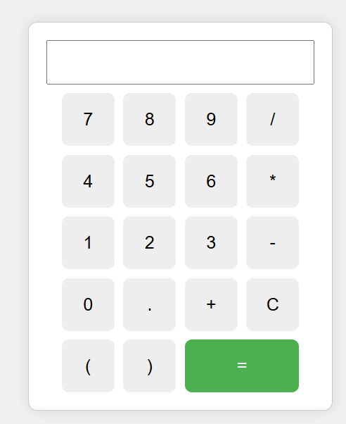

# Smart-Calculator-with-Keyboard-Support
A fully functional **smart calculator web app** built using HTML, CSS, and JavaScript. It supports both mouse clicks and **keyboard input**, making it user-friendly and accessible.

---

## 🎯 Features

- Perform basic arithmetic operations: addition, subtraction, multiplication, division.
- Responsive layout and user-friendly design.
- Supports full **keyboard input** (e.g., number keys, operators, Enter, Backspace).
- Clear button to reset the input.
- Input is auto-focused for seamless typing.
- Displays real-time calculations and results.

---

## 🧱 Technologies Used

- **HTML** – for the structure  
- **CSS** – for layout and design  
- **JavaScript** – for logic and interactivity

---

---

## 🚀 How to Run Locally (Using VS Code)

1. **Install [Visual Studio Code](https://code.visualstudio.com/)** (if not installed already)

2. Open the project folder:
   - File → Open Folder → Select `smart-calculator/`

3. Open `index.html`.

4. Right-click on the file and choose:
   - `Open with Live Server` *(requires Live Server extension)*  
   - OR click `Reveal in File Explorer` → Double-click `index.html` to open in your browser

### 🧩 Recommended: Install Live Server
To auto-reload and easily preview changes:

- Open VS Code Extensions (`Ctrl + Shift + X`)
- Search for **Live Server** by *Ritwick Dey*
- Click **Install**

---

## 🎮 Keyboard Support

You can use your keyboard to interact with the calculator:

- Numbers: `0` – `9`  
- Operators: `+`, `-`, `*`, `/`  
- Enter key: `=` (evaluate expression)  
- Backspace: delete last digit  
- Escape / Clear: reset input

---

## 📸 Screenshot

> *(Add your screenshot image in the project folder with the name `Screenshot.png` or update the path)*

---

## 👨‍💻 Author

**Your Name**  
Passionate about creating interactive web applications and learning new technologies.

---

